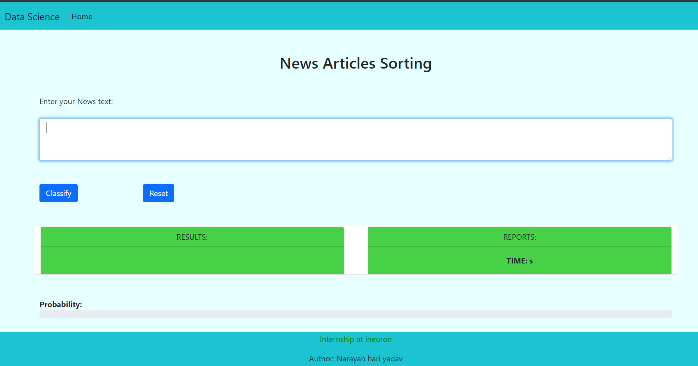

# News Article Sorting

## Desscription
This is a NLP based ML web application which is used to classify the News Articles. <br>
I have used Logistic Regression Classification model.

## File structure 

    .
    ├── data                    # Saved data after data preprocessing
    ├── data_raw                # Documentation files (alternatively `doc`)
    ├── logging                 # Saved looed file
    ├── model_accuracy          # Accuracy of model
    ├── models                  # classification model
    ├── newsarticle             # Django application for news articles sorting
    ├── newsarticlesorting      # Django project 
    ├── plots                   # EDA plots
    ├── report                  # model parameter and pipeline reports.
    ├── src                     # Source files for project implementation
    ├── dvc.yaml                # data version control pipeline.
    ├── manage.py                 
    ├── param.yaml              # parameters
    ├── requirements.txt
    └── README.md

## Objectives
This web application is created for News Article sorting, Nowadays there are many sources to generate news which are in huge amount of data, so this app will help the user to sort the news according to users choice.

## LifeCycle of MAchine Learning Project
Raodmap of implementing machine learning application.
- Gathering the Data
- Data Preparation
- Data Preprocessing
- Create Model
- Evaluate Model
- Deploy the model

## Dataset
The dataset that is used in this project has taken from Kaggle. link is below.
- [datset](https://www.kaggle.com/c/learn-ai-bbc/data)

## Homepage


## :hammer_and_wrench: Requirement
* windows (Operating System)
* Python (Programming Language version 3.5+)
* Django (Python Backend Framework)
* sklearn (Machine Learning Library)
* git (Version Control Distribution)
* pandas (Python Library for Data operations)
* NumPy (Python Library for Numerical operations)
* VS code (IDE)


## Deployment
This web app News articles Sorting is deploy on heroku.
- [App link](https://nasorting.herokuapp.com)


## :desktop_computer: Installation and Setup
To create the News Article Sorting, 
we required environment for development. 
I have used annaconda environment,

```bash
conda create -n envname python=version
```
The above command will create a new environment with specified 
python version.To install requirement library download the requirements.txt file from
current github repository and run the below command. 
```bash
# install all required library in once 
pip install -r requirements.txt
```
In this project, I have used Django python framework. To work with django first we need to create 
project in django then create application by below command.
```bash
django-admin startproject project_name
# create app 
python manage.py startapp app_name
# To run application 
python manage.py runserver 
```

## Contibuter
- Narayan Hari Yadav

# Thank You

